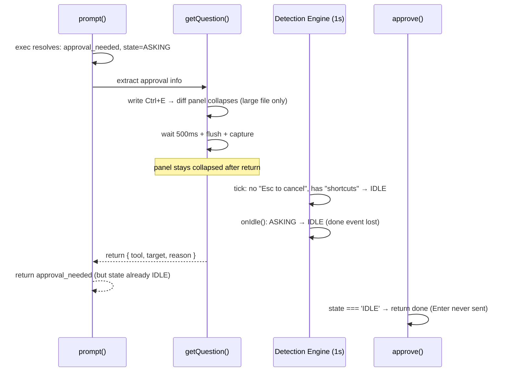

# Fix: approve() returns done without effect due to false IDLE detection

## Bug Description

During a kimi sub-agent task with frequent tool approvals, ALL `approve` calls returned `{ status: 'done' }` but the Enter key was never sent to the terminal. User had to manually approve every tool use in the Claude Code TUI.

## Root Cause

当审批的文件内容较大时，Claude Code TUI 会折叠 diff 预览，底部显示 `ctrl+e to hide`。`getQuestion()` 发送 Ctrl+E (`\x05`) 收起面板以获取审批详情，但收起后不恢复，导致两个问题：

### Problem 1: Detection engine false IDLE

收起面板后 `"Esc to cancel"` 从屏幕消失，但 `"shortcuts"` 仍在底栏：

```
detect():
  match_words: ['❯', 'trust', 'Esc'] → ❯ present → passes gate
  asking_words: ['Esc to cancel', 'I trust'] → NOT found → skip
  idle_words: ['shortcuts', 'accept edits'] → 'shortcuts' found → returns IDLE
```

`onIdle()` transitions ASKING → IDLE. `approve()` hits early return `{ status: 'done' }` without sending Enter.

### Problem 2: Collapsed panel intercepts keyboard input

Even if we fix onIdle() to block ASKING → IDLE, `approve()` would send Enter to the **collapsed panel**, not the approval menu:

- If Enter reopens panel → detection sees ASKING → approve returns `approval_needed` → self-recovers but wastes a round
- If Enter is consumed silently → screen unchanged → detection sees IDLE → `onIdle()`: **PENDING → IDLE** (legitimate transition, can't block) → approve returns `done` → **same bug**

### Trigger condition

Bug only occurs when the file content is large enough for Claude Code to show `ctrl+e to hide` in the approval dialog. Small files show the full diff inline without the toggle — Ctrl+E has no effect and `"Esc to cancel"` remains visible.

### Timeline



### Why ALL approvals fail

`getQuestion()` is called on EVERY `approval_needed` path. For large files, every call collapses the panel. Panel stays collapsed. Every detection tick returns IDLE.

### Reproduction

- **Unit test**: `test/detect.test.js` — `"explain panel screen: detect returns IDLE"` confirms `detect()` returns IDLE on collapsed panel screen content.
- **Unit test**: `test/adapter.test.js` — `"ASKING state is preserved when detection sees IDLE"` confirms `onIdle()` no longer transitions from ASKING.
- **Manual test**: opened kimi session → prompted large file creation → Ctrl+E triggered collapse → confirm via screen capture.

## Fix (applied)

Both changes needed — one prevents state corruption, the other prevents keyboard input being misdirected.

### 1. getQuestion() toggle close after capture

**File**: `src/adapters/claude_code.ts`

Send Ctrl+E again after capturing to toggle the panel back open, restoring the normal approval screen:

```typescript
const screenText = this.terminal.capture()
// Close explain panel (toggle off) to restore normal approval screen
if (rules.input_keys.explain) {
  this.terminal.write(rules.input_keys.explain)
  await this.wait(300)
}
```

### 2. onIdle() remove ASKING → IDLE transition

**File**: `src/adapter.ts`

Defense-in-depth: ASKING state can't be silently dropped by detection engine.

```typescript
case 'PENDING':
case 'RUNNING':
    this.state = 'IDLE'
    this.emit('done', { status: 'done' } as PromptResult)
    break
// ASKING: do NOT transition via detection.
// Legitimate path: approve/reject/allow → PENDING → RUNNING → IDLE.
```

### 3. CLAUDE.md state machine doc

Added `onIdle()` defense note.

### 4. e2e tests: large file consecutive approvals

`test/e2e.test.js` ⑱ and `test/e2e-codex.test.js` ⑨ — prompt changed to require 80+ line files, ensuring Claude Code/Codex shows folded diff with `ctrl+e to hide` toggle. Verifies approve loop works through consecutive large-file approvals.

## Test Results

| Suite | Tests | Pass | Fail |
|---|---|---|---|
| detect.test.js | 40 | 40 | 0 |
| adapter.test.js | 15 | 15 | 0 |
| app.test.js | 36 | 36 | 0 |
| screen.test.js | 12 | 12 | 0 |
| **e2e.test.js** | **45** | **45** | **0** |
| **e2e-codex.test.js** | **28** | **28** | **0** |

Key e2e results:
- Claude Code ⑲: `Consecutive approvals: 2` (large files) ✓
- Codex ⑩: `Consecutive approvals: 3` (large files) ✓

## Changed Files

| File | Change |
|---|---|
| `src/adapter.ts` | `onIdle()` remove ASKING case |
| `src/adapters/claude_code.ts` | `getQuestion()` toggle close after capture |
| `CLAUDE.md` | State machine doc: onIdle defense note |
| `test/adapter.test.js` | +3 tests: onIdle ASKING defense |
| `test/detect.test.js` | +4 tests: ClaudeCode detect with real screen samples |
| `test/e2e.test.js` | ⑱ prompt: large files for folded diff |
| `test/e2e-codex.test.js` | ⑨ prompt: large files for folded diff |
