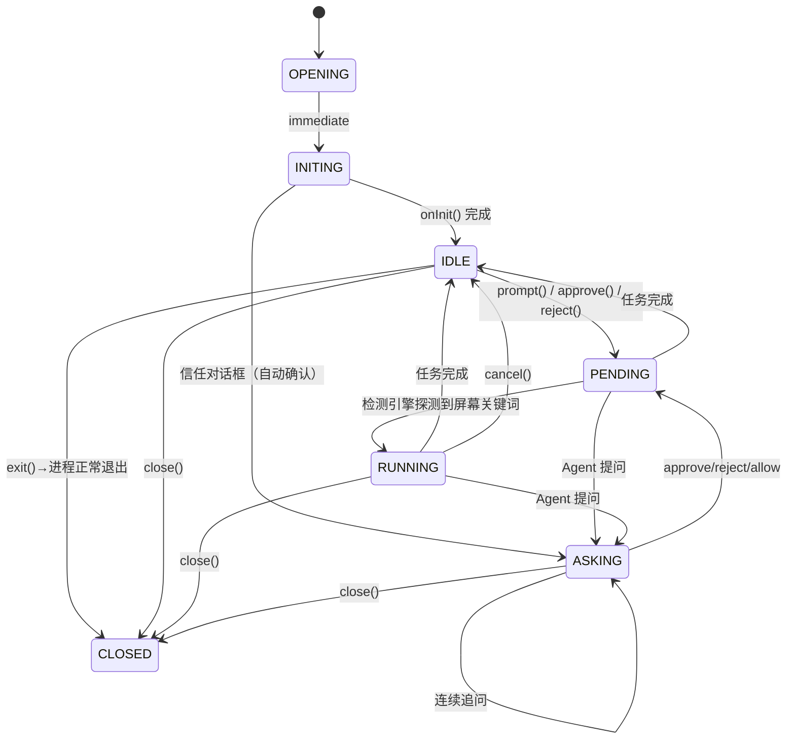
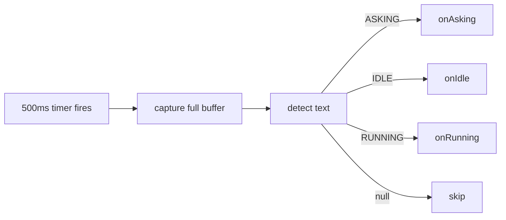
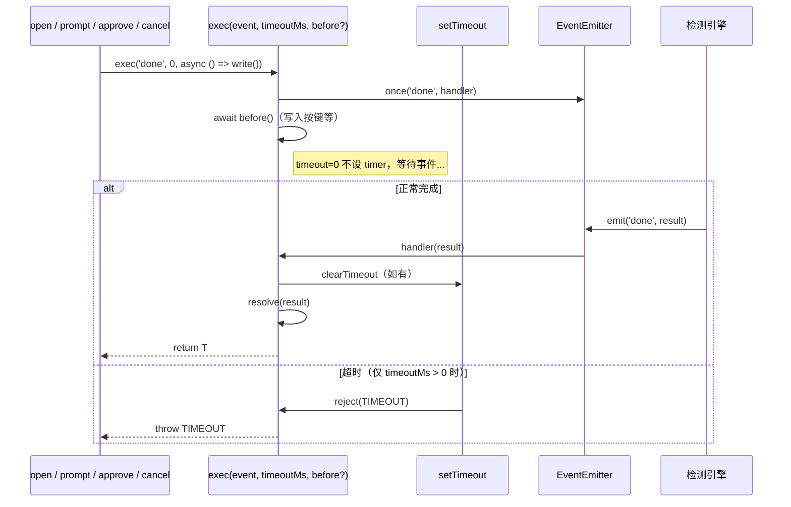

# 状态机与检测引擎

## 1. 状态定义

`SubagentCliAdapter` 使用 7 个状态覆盖完整生命周期：

```typescript
type AgentState = 'OPENING' | 'INITING' | 'IDLE' | 'PENDING' | 'RUNNING' | 'ASKING' | 'CLOSED'
```

| 状态 | 语义 | 旧状态映射 |
|------|------|----------|
| **OPENING** | 启动中（含打开、退出、resume） | OPENING + RESUMING |
| **INITING** | 初始化阶段（信任对话框、MCP 加载等启动期交互） | 新增 |
| **IDLE** | 空闲，可接受新 prompt | READY + DONE |
| **PENDING** | 请求已发，等待大模型前端渲染响应 | 新增 |
| **RUNNING** | Agent 正在执行（由检测引擎从 PENDING 晋升） | WAITING |
| **ASKING** | Agent 在问用户（工具审批、信任确认、任何 yes/no） | APPROVING + TRUSTING |
| **CLOSED** | 进程已退出（exit() 或 close()） | -- |

> `onIdle()` 触发时，通过当前 `state` 区分场景：OPENING/INITING --> 首次就绪（`emit('ready')`），PENDING/RUNNING --> 任务完成（`emit('done', result)`）。ASKING 状态不受检测引擎降级——只能通过 approve/reject/allow → PENDING → RUNNING → IDLE 路径退出。

## 2. 状态转换图



**API 状态守卫**：`state` 本身就是天然的并发锁，每个 API 入口严格校验当前状态，拒绝非法调用。

| API | 允许的 state | 非法调用处理 |
|-----|-------------|-------------|
| **prompt()** | `IDLE` / `ASKING` | RUNNING --> `throw 'SESSION_BUSY'` |
| **approve() / reject() / allow()** | `ASKING` | IDLE --> `{done}`，RUNNING --> `{waiting}` |
| **cancel()** | `RUNNING` | 非 RUNNING --> `{done}` |
| **exit()** | `IDLE` | 非 IDLE --> `throw 'SESSION_BUSY'` |
| **close()** | 任意 | 清理资源，状态-->CLOSED |
| **status()** | 任意 | 同步返回内部 `this.state` |
| **check()** | 任意 | async，屏幕校准，只读不写 |

**幂等设计**：

- IDLE 下调 `approve()` / `reject()` / `allow()` 直接返回 `{done}`
- ASKING 下调 `prompt()` 直接返回当前审批信息 `{approval_needed}`

## 3. 检测引擎设计

Claude Code 运行在交互式 TUI 模式（非 `--bare`），通过 `@xterm/headless` 虚拟终端渲染 ANSI 流为屏幕纯文本，再用 `detect()` 匹配状态。

检测引擎采用 **500ms 间隔定时器轮询**方式，捕获完整 xterm 缓冲区后调用 `detect()` 判断状态。

### 3.1 定时器轮询机制

```
startDetection()  →  每 500ms 触发
                      capture(totalLines)  →  detect(screen)  →  onAsking() / onIdle() / onRunning() / skip
```

- **`startDetection()`**：在 `new PtyXterm` 之后启动 500ms 间隔定时器。幂等，不会重复启动。
- **`stopDetection()`**：停止定时器。在 `close()` 和 `exit()` 中调用。
- 定时器**无论当前 state 如何**始终运行，无状态过滤。
- 每次触发：`this.terminal.capture(this.terminal.totalLines)` → `this.detect(screen)` → 根据结果调用 `onAsking()` / `onIdle()` / `onRunning()`，null 跳过。



### 3.2 `detect()` 纯函数

统一检测函数，定时器轮询和 `check()`（主动）共用，输入不同、逻辑相同：

```typescript
/** Detect agent state from text. Returns null if indeterminate.
 *  Priority: asking_words > running_words > idle_words */
private detect(text: string): AgentState | null {
  const rules = this.getAdapterDetectRules()
  if (!rules.match_words.some(w => text.includes(w))) return null
  if (rules.asking_words.some(w => text.includes(w))) return 'ASKING'
  if (rules.running_words.some(w => text.includes(w))) return 'RUNNING'
  if (rules.idle_words.some(w => text.includes(w))) return 'IDLE'
  return null
}
```

**优先级**：asking_words > running_words > idle_words。`running_words` 命中时跳过（不触发任何状态变更），防止 `esc to interrupt` 和 `accept edits on` 同时出现时误判为 IDLE。

### 3.3 检测关键词

**Claude Code 适配器**：

| 关键词类型 | 关键词 | 说明 |
|-----------|--------|------|
| **match_words** | `❯`（U+276F）、`Esc`、`trust` | 触发检测的门槛词 |
| **asking_words** | `Esc to cancel`、`I trust` | 命中 --> ASKING（最高优先级） |
| **running_words** | `esc to interrupt` | 命中 --> RUNNING（覆盖 idle_words） |
| **idle_words** | `shortcuts`、`accept edits` | 命中且无 running_words --> IDLE（兜底） |

**实测验证**（`accept edits on` 模式下）：

| 状态栏 | asking | running | idle | detect 结果 |
|--------|--------|---------|------|------------|
| `? for shortcuts` | -- | -- | `shortcuts` | **IDLE** |
| `accept edits on (shift+tab to cycle)` | -- | -- | `accept edits` | **IDLE** |
| `accept edits on · esc to interrupt` | -- | `esc to interrupt` | `accept edits` | **RUNNING**（running 优先） |
| `esc to interrupt` | -- | `esc to interrupt` | -- | **RUNNING** |
| `Esc to cancel · Tab to amend` | `Esc to cancel` | -- | -- | **ASKING** |

**Codex CLI 适配器**：

| 关键词类型 | 关键词 |
|-----------|--------|
| **match_words** | `% left`、`esc to`、`tab to queue` |
| **asking_words** | `esc to cancel` |
| **running_words** | `esc to interrupt`、`tab to queue` |
| **idle_words** | `% left` |
| **probe** | `' '` (空格) |

> **Codex Probe 探测**：Codex 在流式输出时 `esc to interrupt` 从屏幕消失，只剩 `% left`。为了区分 Streaming 和 Idle，`onRunning()` 进入 RUNNING 时发送一个空格（`probe: ' '`），Codex TUI 会持续显示 `tab to queue message`。该关键词加入 `running_words`，使 detect() 正确返回 RUNNING。cancel 时先 Ctrl+U 清空输入再发 Escape。对 Claude Code 无影响（不设置 probe）。

> 检测引擎只负责"什么时候状态变了"，不负责"内容是什么"。审批信息由 `getQuestion()` 在检测到 ASKING 后异步提取。

## 4. status() vs check()

| | status() | check() |
|---|---|---|
| **同步/异步** | 同步 | async（flush + capture） |
| **数据来源** | 内部 `this.state` | 屏幕底部 5 行 --> `detect()` |
| **输入** | -- | `capture(5)` xterm 已解析纯文本 |
| **用途** | 快速查询、viewer 列表展示 | 关键操作前确认真实状态 |
| **副作用** | 无 | 无（只读不写，不修改 `this.state`，不 emit） |
| **调用频率** | 任意高频 | 低频（涉及 I/O） |

使用场景：

- **status()**：HTTP API `GET /api/session/:id/status`，快速返回内部状态
- **check()**：HTTP API `GET /api/session/:id/check`，E2E 测试校验、主 agent 操作前确认

两者共用同一个 `detect()` 函数，只是输入来源不同。`check()` 返回的是屏幕校准后的权威状态，可能与 `status()` 的内部状态不一致（见下节）。

## 5. IDLE 误判问题

早期版本（onChunk 被动检测）中存在跨 chunk 边界的检测遗漏问题，已通过切换到定时器轮询方式彻底解决。定时器每次捕获完整 xterm 缓冲区，消除了 PTY chunk 边界效应。

### Codex 输出阶段的 RUNNING 误判

Codex 在开始流式输出后，`esc to interrupt` 从屏幕**完全消失**（不是被遮挡），只留下 `% left` 状态栏。由于 Streaming 和 Idle 阶段的屏幕关键词完全一致（都只有 `% left`），检测引擎无法通过关键词区分两者。

**解决方案 — Probe 探测**：

`onRunning()` 进入 RUNNING 时发送一个空格（`probe: ' '`），Codex TUI 在 RUNNING 期间如果输入框不为空，会持续显示 `tab to queue message`。该关键词加入 `running_words`，使 detect() 在流式输出期间正确返回 RUNNING。

**设计约束**：
- 只发一次：`onRunning()` 转 RUNNING 时发送，不在检测循环中重复
- Claude Code 不适用：Claude Code 发空格会导致 `esc to cancel` 消失，因此不设置 probe
- cancel 时先 `Ctrl+U` 清空输入，再发 Escape

### `esc to interrupt` 残留窗口

Claude 完成任务后，状态栏的 `esc to interrupt` 会**残留约 1-3 秒**才消失。在此窗口期内，`check()` 和定时器均基于 `capture(totalLines)` 进行检测，因此两者的行为是一致的：

- 如果 `esc to interrupt` 仍在屏幕上，`detect()` 返回 RUNNING
- TUI 渲染完成、`esc to interrupt` 消失后，`detect()` 才正确返回 IDLE

由于定时器每 500ms 轮询一次，天然提供了去抖动行为——残留窗口结束后的下一个轮询周期将正确触发 `onIdle()`。E2E 测试中 `assertCheck(IDLE)` 需要轮询等待（每 2s 重试，最多 60s），增加约 1-2s 延迟。

## 6. onIdle / onAsking 行为说明

### onIdle()

`onIdle()` 根据当前 `state` 区分处理场景：

- `OPENING` / `INITING`：首次就绪，emit `'ready'`
- `PENDING` / `RUNNING`：任务完成，emit `'done'`
- `ASKING`：**不处理**。ASKING 状态不受检测引擎降级为 IDLE，防止 `getQuestion()` 的 Ctrl+E（收起大文件审批面板）导致屏幕上 `"Esc to cancel"` 消失后被误判为 IDLE。ASKING 只能通过 approve/reject/allow → PENDING → RUNNING → IDLE 路径退出。

### onRunning()

`onRunning()` 在检测到 RUNNING 关键词时触发，将 PENDING 晋升为 RUNNING：

- 仅在 `state === 'PENDING'` 时执行转换
- 转换后发送 probe 字符（如果配置了），触发 TUI 运行指示器

### onAsking() 与 INITING 阶段

INITING 阶段（如启动信任对话框）检测到 ASKING 时，`onAsking()` 会自动发送 `rules.input_keys.approve` 确认，无需用户介入。

## 7. prompt() 延迟设置 RUNNING

`prompt()` 在 `exec` 的 `before` 回调中将 `this.state` 设置为 `'PENDING'`，由检测引擎探测到屏幕关键词后通过 `onRunning()` 晋升为 RUNNING。

**原因**：定时器始终在后台运行。若直接设为 RUNNING，定时器下一次轮询可能捕获到仍处于 IDLE 的屏幕内容（新 prompt 尚未发出），误调 `onIdle()` 并提前消费 `done` 事件。PENDING 状态作为中间层，确保状态转换与屏幕实际变化同步。

## 8. exec() 统一异步模型

`exec()` 是所有异步等待的统一入口，封装 `once(event)` + `setTimeout` + `before()` 回调。



### 先监听再触发

核心设计：`once()` 监听必须在 `write()` 之前注册。所有 API 方法将 terminal 写入操作作为 `before` 回调传入 `exec()`，确保事件不丢失。

```typescript
// exec() signature
protected exec<T>(event: string, timeoutMs: number, before?: () => Promise<void> | void): Promise<T>
```

**竞态修复背景**：快速模型（haiku）下，`terminal.write()` 触发 terminal echo，定时器下一次轮询检测到缓冲区中的 `idle_words`，调用 `onIdle()` emit `done`。如果 `once('done')` 在 write 之后才注册，事件丢失，`exec` 永远超时。`before` 回调模式彻底消除此竞态。

---

← [架构设计](02-architecture.md) | [目录](index.md) | [HTTP API -->](04-http-api.md)
