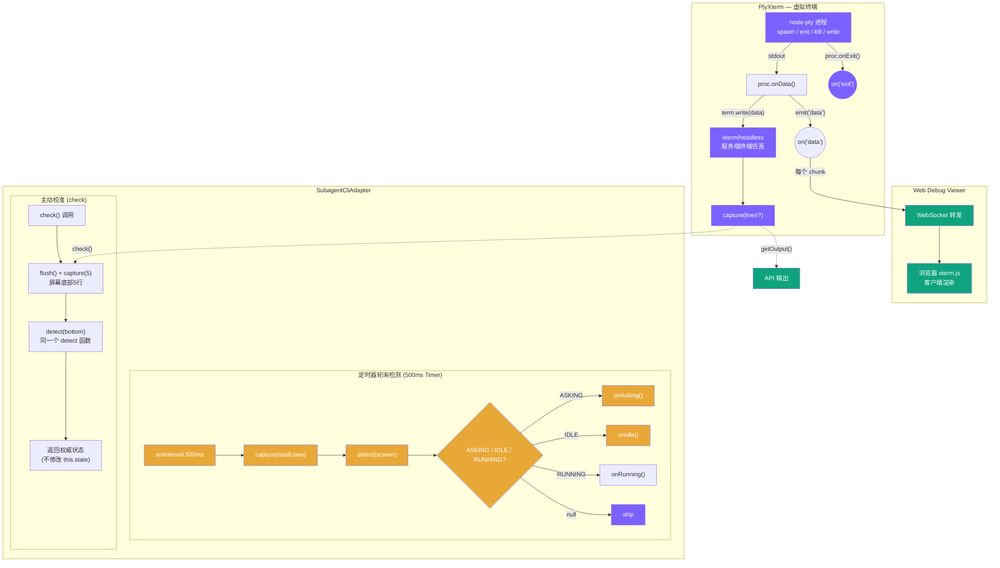
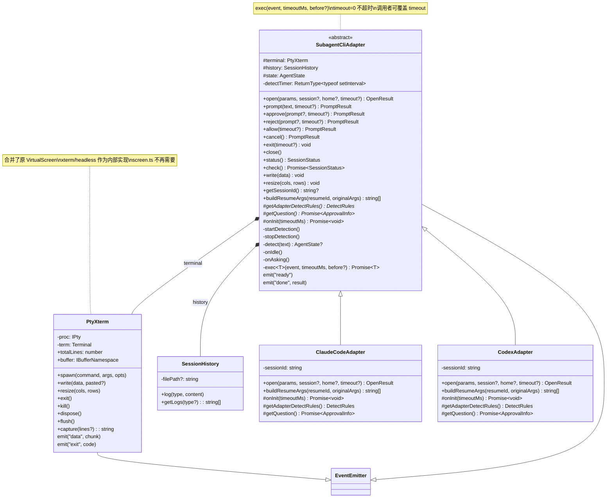
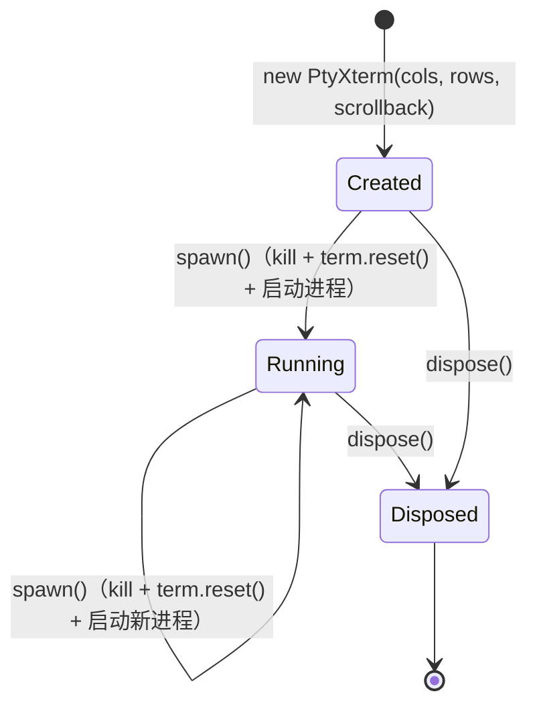
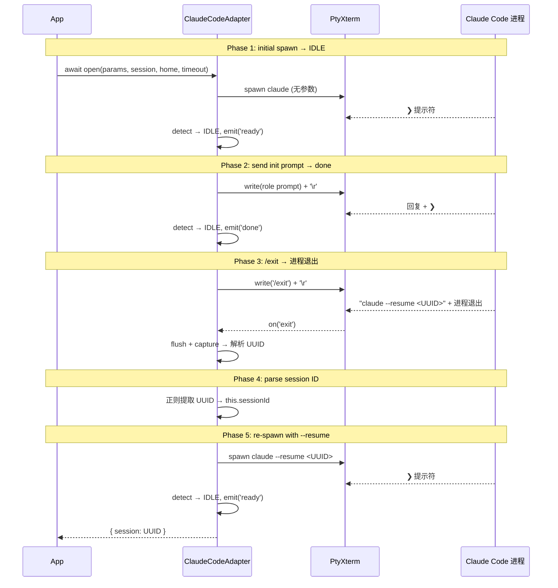
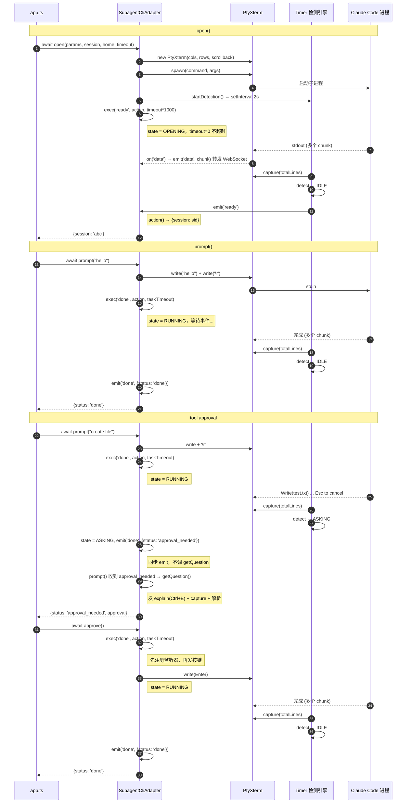
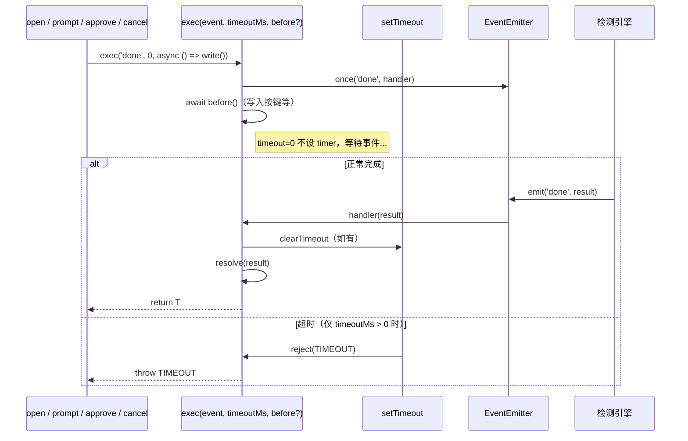
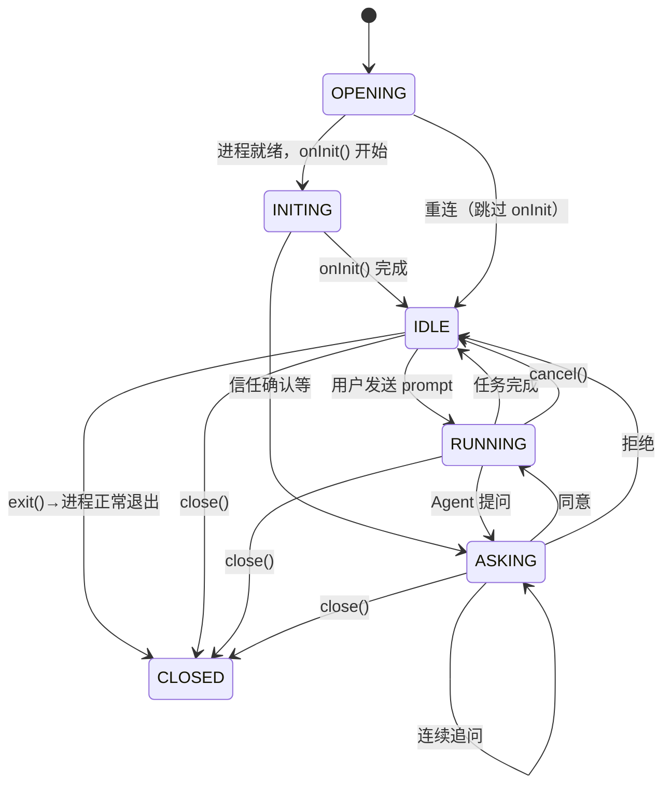

# 类设计与组合架构

## 整体组合模式

Adapter 层采用组合模式：`PtyXterm`（虚拟终端）+ `SessionHistory`（会话历史）独立抽象，`SubagentCliAdapter` 作为业务驱动层组合引用。三者职责清晰分离：

- **PtyXterm** — 1 个实例 = 1 个虚拟终端，内部整合 `node-pty` + `@xterm/headless`
- **SessionHistory** — 1 个实例 = 1 个会话的历史记录文件
- **SubagentCliAdapter** — 业务状态机 + 检测引擎 + 对外 API

## 数据流架构



> 服务端 `xterm/headless` 和浏览器 `xterm.js` 是两个独立的 xterm 实例，各自处理同一份 `on('data')` 原始流。服务端提供 `capture()` 纯文本供 API 输出（`getOutput`）、审批提取（`getQuestion`）和 `check()` 校准使用，浏览器端自行渲染可视终端。`on('data')` 仅做 WebSocket 转发，检测由 2s 定时器轮询 xterm buffer 完成。

## 类图



## 子类契约

子类**必须提供 2 个抽象方法**，可选覆写另外 2 个 virtual 方法：

| 项 | 类型 | 说明 |
|---|---|---|
| `getAdapterDetectRules()` | 抽象方法 | 返回检测规则：`input_keys` / `match_words` / `idle_words` / `running_words` / `asking_words` / `probe`（可选） |
| `getQuestion()` | 抽象方法 | ASKING 时提取审批信息（内部做 explain + flush + capture + toggle close + 正则） |
| `onInit(timeoutMs)` | Virtual（默认：`exec('ready')`） | 启动对话处理。Codex 覆写以应对 Update/Trust/MCP boot 阶段 |
| `buildResumeArgs(resumeId, args)` | Virtual（默认：`[...args, '--resume', id]`） | 拼接 resume 启动参数。Codex 覆写为 `['resume', id, ...args]` 子命令格式 |

可选覆写 `open()` 实现特殊启动流程（如 `ClaudeCodeAdapter` 的 session ID 获取 5 阶段流程）。

## 公开方法与 HTTP API 对应

| 方法 | 对应 API | 说明 |
|---|---|---|
| `open()` | `POST /api/open` | spawn + 启动流程，阻塞到 IDLE |
| `prompt(text)` | `POST /api/session/:id/prompt` | 发送任务，阻塞到完成或审批 |
| `approve(prompt?)` | `POST /api/session/:id/approve` | ASKING 状态下发送 Enter 确认 |
| `allow()` | `POST /api/session/:id/allow` | ASKING 状态下发送 Shift+Tab |
| `reject(prompt?)` | `POST /api/session/:id/reject` | ASKING 状态下发送 Escape 取消 |
| `cancel()` | （内部使用） | RUNNING 状态下发送 cancel 键一次（Escape）中断运行 |
| `exit(timeout?)` | （内部使用） | 发送 `/exit` 正常退出进程 |
| `status()` | `GET /api/session/:id/status` | 同步返回当前状态 |
| `check()` | `GET /api/session/:id/check` | 屏幕校准，async flush+capture→detect |
| `close()` | `POST /api/session/:id/close` | 终止 pty 进程 |

## API 状态守卫

`exec()` 依赖 `once()` 注册一次性监听器。如果同一状态下重复调用（如 RUNNING 时再调 `prompt()`），会注册多个 `once('done')` 监听器，`emit` 只触发最早的那个，后续的永远悬挂。因此每个 API 入口**必须严格校验 state**，拒绝非法调用：

| API | 允许的 state | 非法调用处理 | 说明 |
|-----|-------------|-------------|------|
| **open()** | 首次调用 | -- | 由 app.ts session 管理保证不重复 |
| **prompt()** | `IDLE` / `ASKING` | RUNNING → `throw 'SESSION_BUSY'` | ASKING 时返回 approval_needed |
| **approve()** | `ASKING` | IDLE → `{done}`，RUNNING → `{waiting}` | 提前返回，不注册 once |
| **reject()** | `ASKING` | 同 approve | 同上 |
| **allow()** | `ASKING` | 同 approve | 同上 |
| **cancel()** | `RUNNING` | 非 RUNNING → `{done}` | 发 cancel 键一次（Escape），等待 `done` |
| **exit(timeout?)** | `IDLE` | 非 IDLE → `throw 'SESSION_BUSY'` | 发 `/exit` + 500ms + `\r`，等 on('exit')，超时则 kill，状态→CLOSED |
| **close()** | 任意 | -- | 清理资源，状态→CLOSED，无 exec 调用 |
| **status()** | 任意 | -- | 同步，返回内部 `this.state`（快速，无 I/O） |
| **check()** | 任意 | -- | async，flush + capture(5) → detect(bottom) 返回屏幕校准状态（只读不写，不 emit） |

> 旧的 `busy` 字段删除，完全由 `state` 判断。`state` 本身就是天然的并发锁。

## PtyXterm 类

**定位**：1 个实例 = 1 个虚拟终端。内部整合 `node-pty` + `@xterm/headless`，合并了原 `VirtualScreen`（`screen.ts` 不再需要）。

**文件**：`src/pty_xterm.ts`

### 职责

| 职责 | 关键方法 |
|------|---------|
| 进程管理 | `spawn()` / `exit()` / `kill()` |
| 输入转发 | `write(data, pasted?)` — pasted 模式自动包装 bracketed paste |
| 屏幕捕获 | `flush()` + `capture(lines?)` — flush 确保异步写入完成，capture 获取纯文本 |
| 尺寸调整 | `resize(cols, rows)` |
| 生命周期 | `dispose()`（释放全部资源），`spawn()` 内部调 `term.reset()` 清屏 |
| 事件分发 | `emit('data', chunk)` / `emit('exit', code)` |

### 生命周期状态图



### 关键设计决策

| 决策 | 说明 |
|------|------|
| **单一事件分发** | 所有消费者通过 `on('data')` 订阅同一份原始数据流。PtyXterm 不关心谁在消费。 |
| **spawn = kill + reset + 启动** | `spawn()` 内部先 `kill()` 旧进程，再 `term.reset()` 清屏，最后启动新进程。Terminal 实例不重建。 |
| **exit / kill 分离** | `exit()` 发 SIGTERM（正常退出），`kill()` 发 SIGKILL（强制终止）。进程退出通过 `on('exit')` 事件通知。 |
| **无 dataDisposable** | Terminal 实例不重建，`proc.onData` 回调随进程死亡自动失效，无需手动 dispose。 |
| **reset 清屏** | `spawn()` 内调 `term.reset()` 清屏幕缓冲，不销毁 Terminal 实例，也不暴露独立 `clear()` 方法。 |

## SessionHistory 类

**定位**：1 个实例 = 1 个会话的历史记录文件。

**文件**：`src/session_history.ts`

### 接口

| 方法 | 说明 |
|------|------|
| `log(type, content)` | 追加一条记录，格式为 `## <ISO时间> <type>\n<content>` |
| `getLogs(type?)` | 获取日志记录，可按 type 过滤（如 `getLogs('prompt')`） |

### 设计说明

- `filePath` 可选 — 不传时 `log()` 静默跳过
- `log()` 使用 `appendFileSync` 同步写入，保证顺序
- `getLogs()` 无参数返回全部，传 `type` 按类型正则过滤

## ClaudeCodeAdapter

`ClaudeCodeAdapter` 继承 `SubagentCliAdapter`，实现两个抽象方法，并覆写 `open()` 实现 session ID 获取。

### 检测规则

```typescript
protected getAdapterDetectRules(): DetectRules {
  return {
    input_keys: {
      approve: '\r',                // Enter → option 1: Yes
      allow: '\x1b[B\r',            // Down Enter → option 2: Allow
      reject: '\x1b[B\x1b[B\r',     // Down Down Enter → option 3: No
      amend: '\t',                  // Tab to enter amend mode
      cancel: '\x1b',              // Escape (sent once in cancel())
      explain: '\x05',             // Ctrl+E to explain
      exit: 'exit',                // /exit command to quit
    },
    match_words: ['❯', 'trust', 'Esc'],
    idle_words: ['shortcuts', 'accept edits'],
    running_words: ['esc to interrupt'],
    asking_words: ['Esc to cancel', 'I trust'],
  }
}
```

> **方向键审批**：Claude Code TUI 审批对话框的选项固定为三个位置：Yes(1)→Allow(2)→No(3)。使用方向键 Down + Enter 按位置选择，在不同审批类型（Write/Bash/trust）中行为一致。

### Session ID 获取（5 阶段 open 流程）



- `resumeId` 存储在 session 的 `config.json` 中
- 重连时 args 已含 `--resume`，直接 `OPENING → IDLE`，跳过 5 阶段流程
- 各 phase 透传同一个 `timeout` 参数

### getQuestion() 审批提取

ASKING 状态时由调用方 lazily 调用 `getQuestion()` 提取审批信息：

1. 发送 explain 键（Ctrl+E）展开/收起大文件 diff 面板，获取详细上下文
2. 等待 500ms → flush → capture 全屏
3. 再次发送 Ctrl+E toggle 恢复审批面板原始状态（防止收起后 `"Esc to cancel"` 从屏幕消失，导致检测引擎误判 IDLE）
4. 正则匹配信任对话框或工具审批信息
5. 返回 `ApprovalInfo`（tool + target + reason）

## CodexAdapter

`CodexAdapter` 继承 `SubagentCliAdapter`，覆写 `onInit()` 和 `open()` 以适配 Codex 特有的启动流程。

### 检测规则

```typescript
protected getAdapterDetectRules(): DetectRules {
  return {
    input_keys: {
      approve: '\r',
      allow: '\x1b[B\r',
      reject: '\x1b[B\x1b[B\r',
      amend: '',        // not supported
      cancel: '\x1b',
      explain: '',      // not supported
      exit: 'quit',
    },
    match_words: ['% left', 'esc to', 'tab to queue'],
    idle_words: ['% left'],
    running_words: ['esc to interrupt', 'tab to queue'],
    asking_words: ['esc to cancel'],
    probe: ' ',   // space triggers "tab to queue message" indicator
  }
}
```

### onInit()

轮询 `capture(totalLines)` 每 2s，处理 Codex 启动阶段的多种对话框：

1. Update 提示 → ↓+Enter 跳过
2. Trust directory 确认 → Enter 确认
3. MCP boot（"Booting"）→ 等待
4. 真正 IDLE（"% left"）→ 完成

### open() 启动流程

与 ClaudeCodeAdapter 相同的 5 阶段流程：spawn → init → prompt → /quit → 解析 UUID → resume。使用 `/quit` 替代 `/exit`，resume 命令格式为 `codex resume <UUID>` 子命令。

### 与 ClaudeCodeAdapter 的差异

| 项目 | ClaudeCodeAdapter | CodexAdapter |
|------|-------------------|--------------|
| amend 支持 | `\t`（Tab） | 不支持（空字符串） |
| explain 支持 | `\x05`（Ctrl+E） | 不支持（空字符串） |
| 退出命令 | `/exit` | `/quit` |
| resume 格式 | `claude --resume <id>` | `codex resume <id>` |
| onInit | 默认 exec('ready') | 覆写，处理 Update/Trust/MCP 对话框 |

## Adapter 完整生命周期时序

所有异步等待统一通过 `exec(event, timeoutMs, before?)` 完成：



## exec() 机制

`exec()` 是所有异步等待的统一入口，封装 `once(event)` + `setTimeout` + `before()`：



```typescript
protected exec<T>(event: string, timeoutMs: number, before?: () => Promise<void> | void): Promise<T> {
  const pending = new Promise<T>((resolve, reject) => {
    const timeout = timeoutMs > 0
      ? setTimeout(() => reject(new Error(`${event.toUpperCase()}_TIMEOUT`)), timeoutMs)
      : null
    this.once(event, (result) => {
      if (timeout) clearTimeout(timeout)
      resolve(result)
    })
  })
  return Promise.resolve(before?.()).then(() => pending)
}
```

> **先监听再触发**：`once()` 在 `before()` 之前注册，消除竞态。方向键操作需要 200ms 延迟供 TUI 处理，期间 Claude 可能已完成状态转换，listener 先注册保证事件不丢失。

## 检测触发策略

**定时器轮询检测**：每 500ms 由 `setInterval` 触发，调用 `capture(totalLines)` 获取 xterm 完整 buffer，再传入 `detect()` 判定状态。检测结果为 ASKING、IDLE 或 RUNNING 时触发对应事件；为 null 时跳过。

这一机制彻底消除了跨 chunk 的检测时序问题，无需 `lastChunks` 缓冲或 `stripAnsi()` 处理，检测始终基于当前完整的终端画面。

`on('data')` 回调保留，仅用于向 WebSocket Debug Viewer 转发原始 chunk，不参与检测逻辑。

### 检测关键词（Claude Code 适配器）

| 关键词类型 | 关键词 | 说明 |
|-----------|--------|------|
| **match_words** | `❯`（U+276F）、`Esc`、`trust` | detect() 入口前置过滤，buffer 含任意一词才进入优先级判定 |
| **asking_words** | `Esc to cancel`、`I trust` | 命中 → ASKING（最高优先级） |
| **running_words** | `esc to interrupt` | 命中 → RUNNING（覆盖 idle_words） |
| **idle_words** | `shortcuts`、`accept edits` | 命中且无 running_words → IDLE（兜底） |

### detect() 优先级与实测验证

`detect()` 优先级：asking_words > running_words > idle_words。

| 状态栏 | asking | running | idle | detect 结果 |
|--------|--------|---------|------|------------|
| `? for shortcuts` | -- | -- | `shortcuts` | **IDLE** |
| `accept edits on (shift+tab to cycle)` | -- | -- | `accept edits` | **IDLE** |
| `accept edits on · esc to interrupt` | -- | `esc to interrupt` | `accept edits` | **RUNNING**（running 优先） |
| `esc to interrupt` | -- | `esc to interrupt` | -- | **RUNNING** |
| `Esc to cancel · Tab to amend` | `Esc to cancel` | -- | -- | **ASKING** |

### status() vs check()

| | status() | check() |
|---|---|---|
| **同步/异步** | 同步 | async（flush + capture） |
| **数据来源** | 内部 `this.state` | 屏幕底部 5 行 → `detect()` |
| **用途** | 快速查询、viewer 列表展示 | 关键操作前确认真实状态 |
| **副作用** | 无 | 无（只读不写） |

## 状态机

扩展为 6 个状态，覆盖完整生命周期：

| 状态 | 语义 | 旧状态映射 |
|------|------|----------|
| **OPENING** | 进程启动中（spawn → 等待初始化完成） | OPENING + RESUMING |
| **INITING** | 启动后对话处理阶段（onInit 处理 Update/Trust/MCP 对话框） | -- |
| **IDLE** | 空闲，可接受新 prompt | READY + DONE |
| **RUNNING** | Agent 正在执行 | WAITING |
| **ASKING** | Agent 在问用户（工具审批、信任确认） | APPROVING + TRUSTING |
| **CLOSED** | 进程已退出（exit() 或 close()） | -- |



> onIdle 触发时，通过当前 `state` 区分场景：OPENING/INITING → 首次就绪（`emit('ready')`），PENDING/RUNNING → 任务完成（`emit('done', result)`）。ASKING 状态不受检测引擎降级——只能通过 approve/reject/allow → PENDING → RUNNING → IDLE 路径退出。

## TypeScript 类型定义

```typescript
export type AgentState = 'OPENING' | 'INITING' | 'IDLE' | 'PENDING' | 'RUNNING' | 'ASKING' | 'CLOSED'

export interface DetectRules {
  input_keys: {
    approve: string     // '\r' (Enter)
    allow: string       // '\x1b[B\r' (Down + Enter)
    reject: string      // '\x1b[B\x1b[B\r' (Down Down + Enter)
    amend: string       // '\t' (Tab)
    cancel: string      // '\x1b' (Escape)
    explain: string     // '\x05' (Ctrl+E)
    exit: string        // 'exit' or 'quit' — command to quit the CLI
  }
  match_words: string[]
  idle_words: string[]
  running_words: string[]
  asking_words: string[]
  /** Probe character sent once on entering RUNNING to trigger a running indicator. */
  probe?: string
}

export interface ApprovalInfo {
  tool: string
  target: string
  reason?: string
}

export interface OpenParams {
  subagent: string
  adapter: string
  cwd: string
  command: string
  args: string[]
  env: Record<string, string>
}

export interface OpenResult {
  session: string
}

export interface PromptResult {
  status: 'done' | 'approval_needed'
  approval?: ApprovalInfo
}

export interface SessionStatus {
  state: AgentState
  subagent: string
  cwd: string
  created_at: string
}

export interface PtySpawnOptions {
  cwd: string
  env: Record<string, string>
}
```

---

← [04-http-api.md](04-http-api.md) | [目录](index.md) | → [06-detect-engine.md](06-detect-engine.md)
